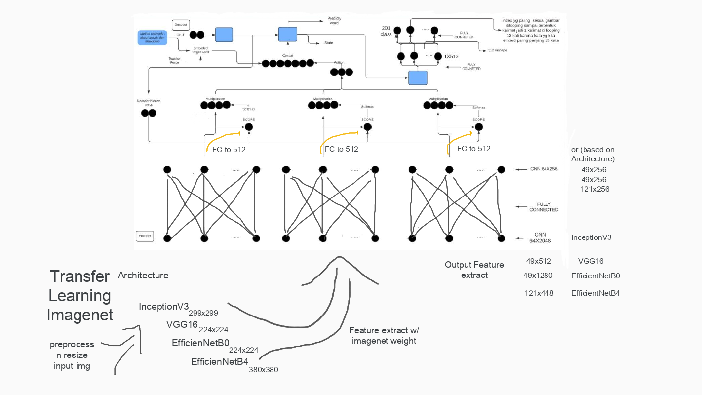

# img_caption_dl_textAnalytic for smart local tourism

### clone repo
    
    git clone https://github.com/img-caption-mania/img_caption_dl_textAnalytic.git
    
    cd img_caption_dl_textAnalytic

### create env

    conda create -n myenv python=3.7
    
    conda activate myenv

### conda install requirements for notebook
    
    conda install notebook ipykernel nb_conda_kernels
    
    pip install -r requirements.txt
    
    or
    pip install -r requirements-gpu.txt # if u want to use GPU


### download dataset
    
    gdown https://drive.google.com/uc?id=1ZChja5DOLoeLMbJ-StFagQp5nRRGkWJn
    tar -xvzf image_gabung_with_feature.tar.gz

## img_caption based on deep learning and textAnalytic class at University Islam Indonesia for supporting local tourism

- after download all images using chrome extension download all image

- create unique name in folder
 
      python script_utils/randomfilerenamer.py 1_tugu_jogja 

- captioning image
- read file  
- python read_file.py <folder_image> <output_readfile>

      python script_utils/read_file.py ../1_tugu_jogja name_file.txt

- mapping anotasi
- python mapping_anotasi.py <list_anotasi manual> <output_readfile> <output caption json>

```bash
python script_utils/mapping_anotasi.py list_anotasi.txt name_file.txt caption_tugu.json
```
  
- manually crosscheck
http://jsonviewer.stack.hu/

- Finally merge all captions and image into each of it's folder

link dataset https://drive.google.com/file/d/1m3YnP7C54bsxdTjcWheCkBehUUemhywF/view?usp=sharing


